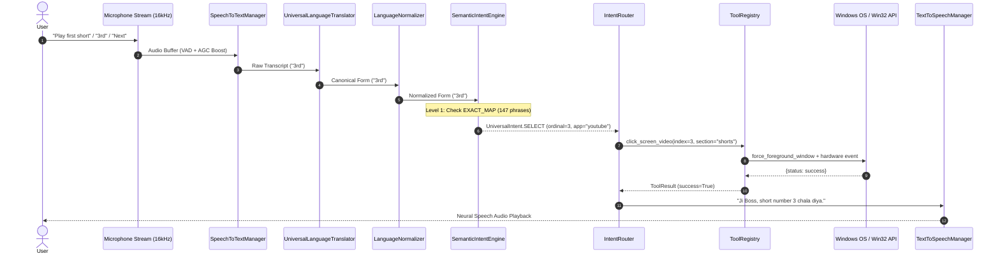

# =====================================================================
# JARVIS COMMAND ROUTING FORENSICS & PIPELINE AUDIT
# =====================================================================

This report maps the end-to-end execution path of user voice/text commands, analyzes exact match dictionaries, evaluates regex scoring clusters, and pinpoints where routing collisions occur.

## Execution Flow Architecture

---

## 1. Level 1: Exact Deterministic Dictionary (`EXACT_MAP`)
- **Total Exact Phrases Registered**: 147 phrases.
- **Bypass Latency**: $< 0.1	ext{ms}$ (instant dictionary hash lookup).
- **Categories Covered**:
  - YouTube Shorts: 1st, 2nd, 3rd, 4th, 5th, Next Short, Prev Short, single-word ordinals (`1st`, `first`, `2nd`, `second`, `3rd`, `third`, `4th`, `fourth`, `5th`, `fifth`, `next`, `agla`, `prev`, `pichla`).
  - YouTube Videos: Play first video, play second video, pause, resume, seek forward, seek backward, captions, theater mode, fullscreen.
  - WhatsApp: Message, voice call, video call, end call, mute call, view status, delete message.
  - System Controls: Shutdown, restart, sleep, lock, cancel shutdown, clean junk, empty recycle bin, system health.
  - Window Management: Switch window, minimize, maximize, restore, close.

---

## 2. Level 2: Pattern Scoring & Multi-Intent Disambiguation
When an utterance is not in `EXACT_MAP`, `SemanticIntentEngine` computes match scores across 53 regex clusters in `INTENT_SEMANTIC_PATTERNS`.
- Threshold for deterministic dispatch: **`confidence >= 0.65`**.
- Multi-Intent Splitting: Detects compound conjunctions (`aur`, `and`, `then`, `ke baad`, `phir`, `comma`) and decomposes them into discrete sequential sub-intents.

---

## 3. Level 3: Generative AI Fallback (Google Gemini)
When confidence $< 0.65$:
- Request dispatched to `backend.ai.agent.JarvisAgent` $
ightarrow$ `backend.ai.providers.GeminiProvider`.
- Model: `gemini-2.5-flash` / `gemini-3.6-flash`.
- Temperature: `0.2` (strict deterministic execution).
- Function Calling: Receives 62 tool schemas generated by `ToolRegistry.get_openai_tool_schemas()`.

---

## 4. Root Causes of Command Misrouting & Collisions
1. **Shared Verb Overlap in Regex Clusters**:
   - `UniversalIntent.PLAY` regex `r"\b(?:play|chalao|baja|laga)\b"` matches video playback, audio playback, and app launching simultaneously if target app is omitted.
2. **Foreground Window Ambiguity**:
   - If the user says "play" without mentioning "YouTube" or "Spotify", the system inspects `_get_current_active_application()`. If Chrome window title has updated slowly, intent routes to default system media instead of browser media.
3. **Single-Word Command Collisions**:
   - Words like "next" or "open" previously lacked explicit single-word mappings, causing them to fall through to generative AI or generic window switching.
