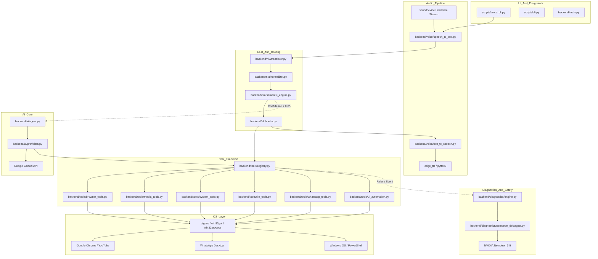

# =====================================================================
# JARVIS DEPENDENCY GRAPH & SYSTEM COUPLING AUDIT
# =====================================================================

This document analyzes the structural dependencies, module couplings, and single points of failure across the JARVIS architecture.

## 1. System Dependency Architecture

---

## 2. Single Points of Failure (SPOF)
1. **Audio Device Initialization (`sounddevice`)**:
   - `speech_to_text.py` connects directly to Windows WASAPI audio input. If another app claims exclusive mode or sample rate changes, voice capture fails entirely.
2. **Foreground Window Active Focus (`win32gui`)**:
   - Browser and media tools rely on `force_foreground_window(hwnd)`. If Windows UIPI (User Interface Privilege Isolation) prevents thread attachment, keyboard shortcuts fail.
3. **Global Tool Registry State (`default_registry`)**:
   - All tools register to a single in-memory instance `default_registry`. Any runtime mutation or unhandled exception during registration affects all subsequent tool calls.
4. **Internet Connectivity for Primary Brain & Speech**:
   - Google Speech API and Gemini API require continuous WAN connectivity. Offline mode gracefully falls back to SAPI5 TTS and regex routing.

---

## 3. High Coupling Hotspots
- `backend/tools/browser_tools.py` $\leftrightarrow$ `backend/tools/media_tools.py`: Both implement overlapping YouTube playback functions (`click_screen_video` vs `control_media`).
- `backend/nlu/semantic_engine.py` $\leftrightarrow$ `backend/nlu/router.py`: Tight coupling where intent enums must be identically synchronized across both files.
